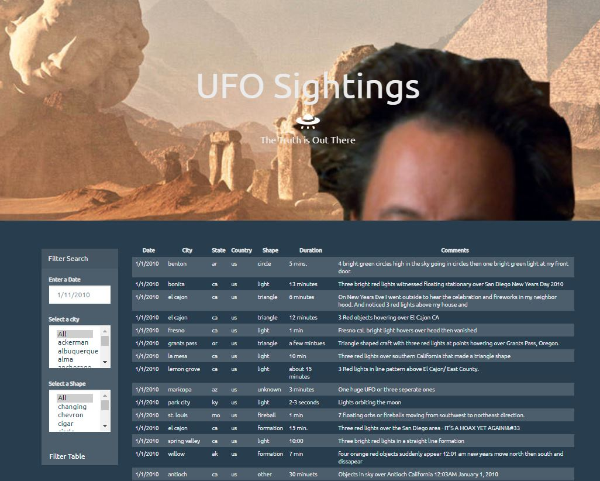

#  Alien Sighting Records and Javascript

 ## Overview
- The goal of this project was to create a webpage that displays a table with multiple filtering options. The data source is a collection of details regarding 111 alien encounters.

 ## Programs, Languages and tools
  - Javascript
  - HTML
  - CSS
  - D3
  - Bootstrap

 ## File overview
  - #### data.js
    ##### *source data*
  - #### html_codes.js
    ##### *dictionary used for data cleaning*
  - #### app.js
    ##### *application code file*
  - #### style.css
    ##### *main css styling*
  - #### index.html
    ##### *HTML framework*

 ## Steps/Process

  - ### Step 1: Set-up
      - HTML, Bootstrap, and CSS were used to create the framework and styling for the webpage
      - For the html form lists, only the "All" option was included in the html, the rest were dynamically added with javascript
      - The tbody for the HTML is initially blank, but is filled using javascript 

  - ### Step 2: Processing User Input and Generating Output
      - I started off by creating 3 list of unique entries for the Datetime, City, and Shape. I used the list of unique dates to process out-of-range issues with user inputs. Also, I used the unique shape and city lists to populate the form selector on hte left side of the page.
      - Then, I wrote a few lines of code that would correct the form at of the date input if it was typed incorrectly
      - Then, I wrote a few lines of code that would take the user's date input and change it to have uniform formatting.
      - By using "if" statements, I made a decision tree that would determine which filter should be used based on the user's input. My use of the "All" options for the city and shape made this a little more difficult.

        
  - ### Step 3: Generating Final Table
      - I created a subfunction to handle appending data to the html table. I decided to create this as it's own function so I could use the same code at different points depending on the user's input.

 ## How to use the program
  - Simply open the index.html file in your browser and search/filter using the filter pane to explore the table.

 ## Findings and Conclusion
    
  - This project was a great introduction to Javascript and utilizes my knowledge of HTML and CSS. I was able to implement 3 different filters. Utilizing CSS animations was interesting. I attempted to clean the data, however more could have been done. Instead of cleaning data after the fact, I think it would have been a good idea to keep the data uniform by limiting the users' input. This would have made the duration field more consistent and useful.
  
      
